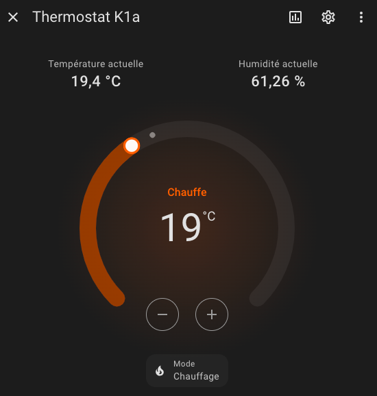
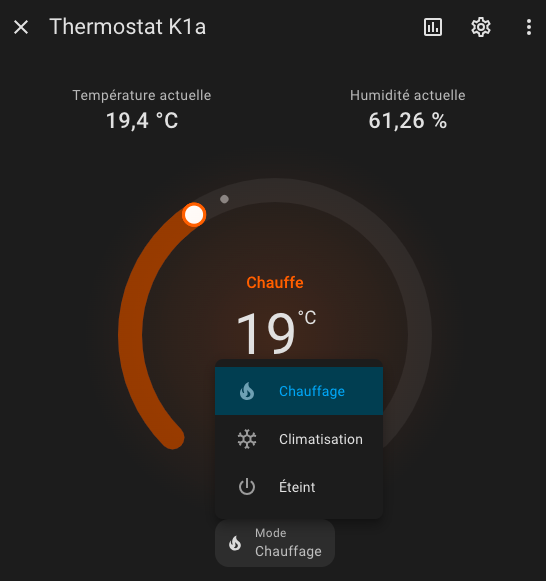
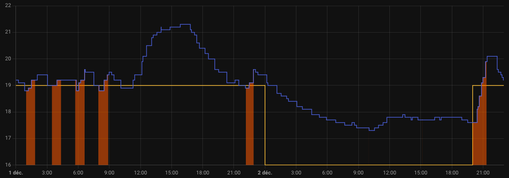

# Passerelle ESPHome pour Aldes T.One® AIR

**Attention :** cette page indépendente du fabricant présente des idées dont la mise en pratique nécessite des connaissances approfondies en chauffage, climatisation, électricité, électronique et informatique. Les risques sont nombreux et des erreurs graves figurent très probablement dans cette page. L'auteur se dégage de toute responsabilité liée à la mise en oeuvre de ce projet. N'utilisez pas ce projet, utilisez la passerelle officielle [AldesConnect® Box](https://www.aldes.fr/produits/mesure-regulation-et-connectivite/capteurs-et-connectivite/autres-capteurs/aldesconnect-box).

**Note :** un énorme merci à la [communauté d'HACF](https://forum.hacf.fr/t/aldes-t-one-air-aquaair/42974) dans laquelle nous travaillons sur le sujet depuis plus de 2 ans !

**Ce projet expérimental permet de piloter un système Aldes T.One® AIR via le réseau local et propose en particulier une intégration poussée dans HomeAssistant sous la forme d'entités Climate pour chaque thermostat.**







## Matériel

### Base : pilotage Modbus

Dans cette configuration de base on alimente l'ESP32 par son port USB en le branchant sur le port USB du dessus normalement dédié à la box officielle.

+ PCB (récupérer le [fichier Gerber](gerber-v1.0.zip) ou le [projet EasyEDA](easyeda-v1-0.json) et le faire fabriquer sur un site comme JLCPCB.com)
+ D1 mini ESP32 ([AliExpress](https://fr.aliexpress.com/item/1005005972627549.html))
+ Convertisseur RS485/TTL ([AliExpress](https://fr.aliexpress.com/item/1005006340391490.html))
+ Convertisseur de niveau logique bidirectionnel 5V <=> 3.3V ([AliExpress](https://fr.aliexpress.com/item/1005006068381598.html))
+ Terminal 4 bornes ([AliExpress](https://fr.aliexpress.com/item/32828459901.html))

Connectique :

+ Headers mâles ([AliExpress](https://fr.aliexpress.com/item/32973181162.html))
+ Pince à sertir et embouts ([AliExpress](https://fr.aliexpress.com/item/32831768783.html))
+ Facultatif : headers femelle doubles (2) pour l'ESP32 ([AliExpress](https://fr.aliexpress.com/item/32747224548.html))
+ Falcutatif : headers femelle simples pour les autres circuits ([AliExpress](https://fr.aliexpress.com/item/32854239374.html))

### Amélioration 1 : alimentation par le Modbus

Ici on alimente le tout via le 12V du Modbus.

+ Convertisseur 12V => 5V ([AliExpress](https://fr.aliexpress.com/item/1005006486270630.html)) : penser à régler la sortie sur 5V avant de le brancher au reste !

### Amélioration 2 : récupération de l'état des bouches de diffusion

Avec ces ajouts, on peut savoir si les bouches de diffusion (4 maximum avec ce PCB) sont ouvertes ou fermées, ce qui permet de savoir si la PAC est active ou pas et pour quelle pièce.

+ Convertisseur numérique de niveaux logiques 12V => 3.3V à 4 voies ([AliExpress](https://fr.aliexpress.com/item/1005003772569293.html))
+ Terminal 2 bornes * 4 ([AliExpress](https://fr.aliexpress.com/item/32828459901.html))
+ Embouts doubles ([AliExpress](https://fr.aliexpress.com/item/1005004846852618.html))

Les terminaux K sont à relier aux terminaux correspondants sur la carte mère de la PAC, où sont déjà branchés les câbles menant aux bouches. Attention, la polarité n'est pas importante pour les vérins des bouches selon la documentation officielle, mais elle est importante ici. Assurez-vous d'obtenir +12V au niveau du terminal quand la bouche est ouverte, et pas -12V !

### Amélioration 3 : récupération des températures réelles et des humidités

En ajoutant un capteur à proximité de chaque thermostat, nous récupérons la température et l'humidité réelle dans chaque pièce.

Exemple de matériel :

+ Aqara température & humidité ([AliExpress](https://fr.aliexpress.com/item/1005002700355577.html))
+ Sonoff Zigbee 3.0 USB ([AliExpress](https://fr.aliexpress.com/item/1005006586489918.html))

## Schéma


Les condensateurs U6 et U7 ne sont pas à mettre.

## PCB


Les condensateurs C1 et C2 ne sont pas à mettre.

## Photo


## ESPHome

```yaml
uart:
  baud_rate: 19200
  tx_pin: GPIO16
  rx_pin: GPIO17
  parity: EVEN

modbus_controller:
- address: 0x1

binary_sensor:
  - platform: modbus_controller
    name: "Changer filtre"
    device_class: problem
    entity_category: diagnostic
    icon: mdi:air-filter
    register_type: holding
    address: 0x0082
  - platform: gpio # Avec amélioration 2 et bouche K1a
    name: "Bouche K1a"
    device_class: opening
    icon: "mdi:hvac"
    pin:
      number: GPIO34
      mode: INPUT
    filters:
      - delayed_on: 100ms
      - delayed_off: 50000ms
  - platform: gpio # Avec amélioration 2 et bouche K2
    name: "Bouche K2"
    device_class: opening
    icon: "mdi:hvac"
    pin:
      number: GPIO35
      mode: INPUT
    filters:
      - delayed_on: 100ms
      - delayed_off: 50000ms
  - platform: gpio # Avec amélioration 2 et bouche K3
    name: "Bouche 3"
    device_class: opening
    icon: "mdi:hvac"
    pin:
      number: GPIO36
      mode: INPUT
    filters:
      - delayed_on: 100ms
      - delayed_off: 50000ms
  - platform: gpio # Avec amélioration 2 et bouche K4
    name: "Bouche K4"
    device_class: opening
    icon: "mdi:hvac"
    pin:
      number: GPIO34
      mode: INPUT
    filters:
      - delayed_on: 100ms
      - delayed_off: 50000ms

number:
  - platform: modbus_controller
    name: "Thermostat K1a"
    icon: "mdi:thermostat"
    unit_of_measurement: "°C"
    address: 0x96
    value_type: U_WORD
    min_value: 16
    max_value: 31
    use_write_multiple: true
    multiply: 100
  - platform: modbus_controller # Commenter si vous n'avez pas de K1b
    name: "Thermostat K1b"
    icon: "mdi:thermostat"
    unit_of_measurement: "°C"
    address: 0x97
    value_type: U_WORD
    min_value: 16
    max_value: 31
    use_write_multiple: true
    multiply: 100
  - platform: modbus_controller
    name: "Thermostat K2"
    icon: "mdi:thermostat"
    unit_of_measurement: "°C"
    address: 0x98
    value_type: U_WORD
    min_value: 16
    max_value: 31
    use_write_multiple: true
    multiply: 100
  - platform: modbus_controller
    name: "Thermostat K3"
    icon: "mdi:thermostat"
    unit_of_measurement: "°C"
    address: 0x99
    value_type: U_WORD
    min_value: 16
    max_value: 31
    use_write_multiple: true
    multiply: 100
  - platform: modbus_controller
    name: "Thermostat K4"
    icon: "mdi:thermostat"
    unit_of_measurement: "°C"
    address: 0x9a
    value_type: U_WORD
    min_value: 16
    max_value: 31
    use_write_multiple: true
    multiply: 100
  - platform: modbus_controller
    name: "Tarif HP"
    icon: mdi:currency-eur
    entity_category: config
    mode: box
    unit_of_measurement: "€"
    address: 0xA0
    value_type: U_WORD
    min_value: 0.05
    max_value: 1
    use_write_multiple: true
    multiply: 1000
    step: 0.001
  - platform: modbus_controller
    name: "Tarif HC"
    icon: mdi:currency-eur
    entity_category: config
    mode: box
    unit_of_measurement: "€"
    address: 0xA1
    value_type: U_WORD
    min_value: 0.05
    max_value: 1
    use_write_multiple: true
    multiply: 1000
    step: 0.001

select:
  - platform: modbus_controller
    name: "Mode air"
    icon: "mdi:hvac"
    address: 0x007A
    value_type: U_WORD
    use_write_multiple: true
    optimistic: true
    optionsmap:
      "off": 0
      "heat": 1
      "Chauffage économique": 2
      "Programme chauffage A": 3
      "Programme chauffage B": 4
      "cool" : 5 # Si vous avez la climatisation activée
      "Climatisation boost" : 6 # Si vous avez la climatisation activée
      "Programme climatisation C" : 7 # Si vous avez la climatisation activée
      "Programme climatisation D" : 8 # Si vous avez la climatisation activée

sensor:
  - platform: modbus_controller
    name: "Version logiciel"
    disabled_by_default: true
    entity_category: diagnostic
    icon: mdi:package
    register_type: holding
    address: 0x0001
    value_type: U_WORD
  - platform: modbus_controller
    name: "Identifiant IHM"
    disabled_by_default: true
    entity_category: diagnostic
    icon: mdi:identifier
    register_type: holding
    address: 0x000E
    value_type: U_DWORD
  - platform: modbus_controller
    name: "Date et heure"
    device_class: timestamp
    disabled_by_default: true
    entity_category: diagnostic
    icon: mdi:calendar-clock
    register_type: holding
    address: 0x0010
    value_type: U_DWORD
  - platform: modbus_controller
    name: "Temperature principale"
    device_class: "temperature"
    state_class: "measurement"
    register_type: holding
    address: 0x0078
    value_type: S_WORD
    unit_of_measurement: "°C"
    accuracy_decimals: 1
    filters:
      - multiply: 0.01
  - platform: modbus_controller
    id: mode_air
    internal: true
    register_type: holding
    address: 0x007A
  - platform: modbus_controller
    id: thermostat_1
    internal: yes
    register_type: holding
    address: 0x96
    value_type: U_WORD
    unit_of_measurement: "°C"
    accuracy_decimals: 1
    filters:
      - multiply: 0.01
  - platform: modbus_controller
    id: thermostat_2
    internal: yes
    register_type: holding
    address: 0x98
    value_type: U_WORD
    unit_of_measurement: "°C"
    accuracy_decimals: 1
    filters:
      - multiply: 0.01
  - platform: modbus_controller
    id: thermostat_3
    internal: yes
    register_type: holding
    address: 0x99
    value_type: U_WORD
    unit_of_measurement: "°C"
    accuracy_decimals: 1
    filters:
      - multiply: 0.01
  - platform: modbus_controller
    id: hp
    register_type: holding
    address: 0xA0
    value_type: U_WORD
    unit_of_measurement: "€"
    accuracy_decimals: 4
    filters:
      - multiply: 0.001
  - platform: modbus_controller
    id: hc
    register_type: holding
    address: 0xA1
    value_type: U_WORD
    unit_of_measurement: "€"
    accuracy_decimals: 4
    filters:
      - multiply: 0.001

text_sensor:
  - platform: modbus_controller
    name: "Aiguillage vanne"
    icon: mdi:valve
    entity_category: diagnostic
    register_type: holding
    address: 0x0064
    raw_encode: HEXBYTES
    lambda: |-
      uint16_t value = modbus_controller::word_from_hex_str(x, 0);
      switch (value) {
        case 0: return std::string("Etat initial");
        case 1: return std::string("ECS");
        case 2: return std::string("Air");
        case 3: return std::string("Standby");
        case 4: return std::string("Standby sécurité");
        case 5: return std::string("En cours de modification");
        default: return std::string("Inconnu");
      }
      return x;
```

**Note :** [Pour l'AquaAir, Modbus permet d'autres choses](https://forum.hacf.fr/t/aldes-t-one-air-aquaair/42974/171)

## Home Assistant

Installer [hass-template-climate](https://github.com/jcwillox/hass-template-climate) et définir une entité climate pour chaque thermostat :

```yaml
climate:
  - platform: climate_template
    name: Thermostat K1a
    unique_id: climate_template_thermostat_k1a
    availability_template: "{{ is_state('sensor.esphome_aldes_tone_aiguillage_vanne', 'Air') }}"
    modes:
      - "cool" # Si la climatisation est activée
      - "heat"
      - "off"
    hvac_mode_template: "{{ states('select.esphome_aldes_tone_mode_air') }}"
    set_hvac_mode:
      - action: select.select_option
        data:
          entity_id: select.esphome_aldes_tone_mode_air
          option: "{{ hvac_mode }}"
    # hvac_action_template: idle # Sans amélioration 2
    hvac_action_template: >- # Avec amélioration 2
      
         heating
         cooling
         idle
        
       off
      
    current_humidity_template: "{{ states('sensor.aqara_temperature_et_humidite_thermostat_k1a_humidity') }}" # Avec amélioration 3
    current_temperature_template: "{{ states('sensor.aqara_temperature_et_humidite_thermostat_k1a_temperature') }}" # Avec amélioration 3
    min_temp_template: >-
       16
       22
      
    max_temp_template: >-
       24
       31
      
    target_temperature_template: "{{ states('number.esphome_aldes_tone_thermostat_k1a') }}"
    set_temperature:
      - action: number.set_value
        data:
          entity_id: number.esphome_aldes_tone_thermostat_1
          value: "{{ temperature }}"
```